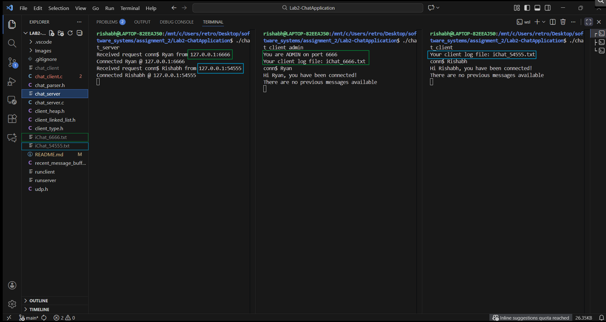
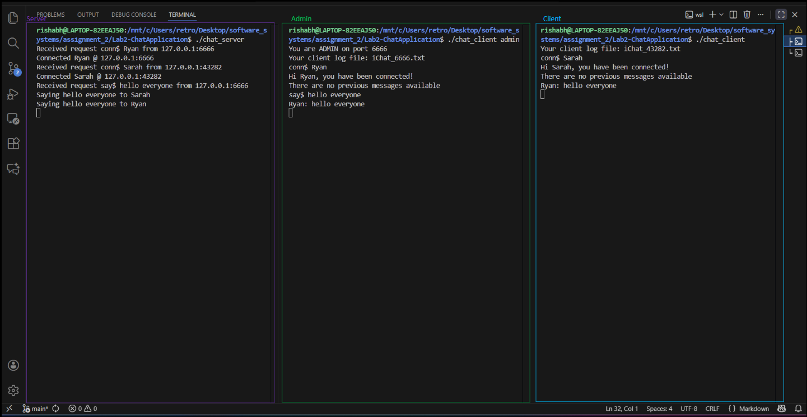
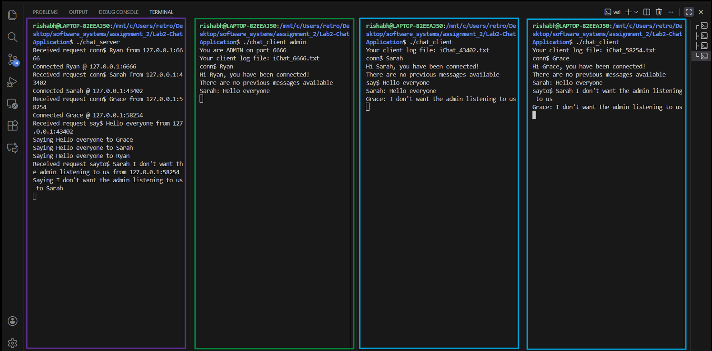
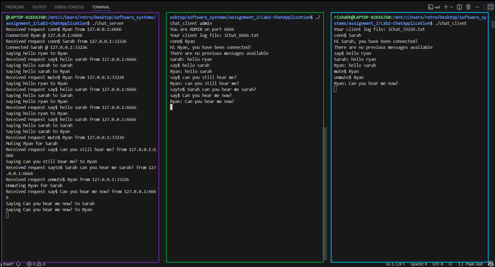
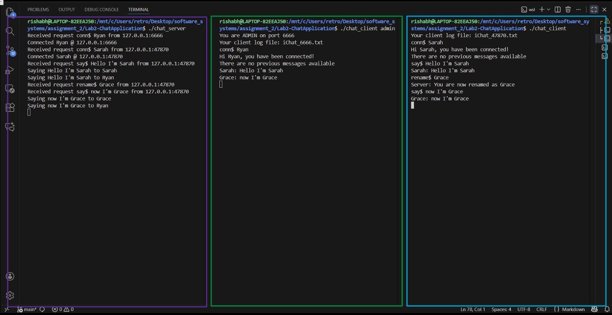
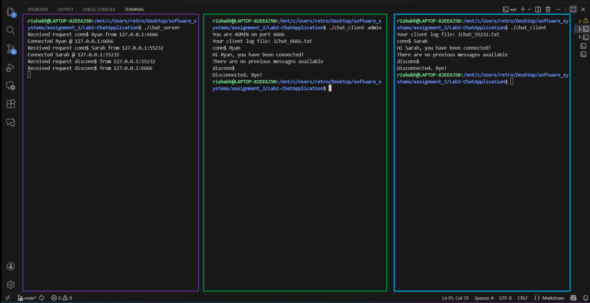
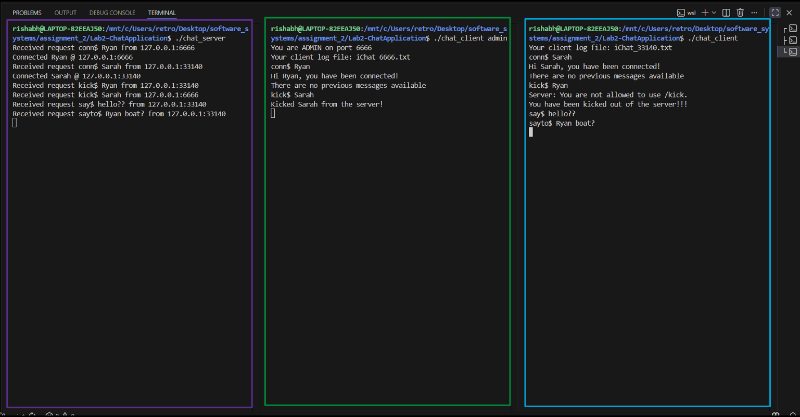

# Lab 2 - Multithreaded Chat Application

_Ryan George and Rishabh Rastogi_  
Our implementation of a C based chat application, completing all the proposed extensions and thoroughly tested.

## Development

The development process we naturally followed was iterative and prototype based, where we completed incremental prototypes and tested along the way. This can be seen in our git commits, implementing and evaluating small changes till it met the project requirements. For this project, we split the work into three: Chat Server (Ryan), Chat Client (Rishabh) and Testing (Rishabh).

The client was quite small and relatively simple, so we placed an emphasis on polishing the server so it has full functionality and has safeguards to eliminate undefined behaviour especially with NULL pointers, handling the heap and invalid requests from clients. This was done in both development and testing.

Like the first project, we extensively used git to source control our work and used Github as our remote:
  
This was very useful in catching errors and seeing the progress that we both were completing. As before, any bugs that appeared first time for example, could be usually pinpointed by `git diff` with the previous commit hash (-y really helps).  
In general, we communicated great and completed both assignments within 4 weeks, leaving us time to polish/comment our code and write the README.

## Features

In this assignment, we successfully implemented a multithreaded chat application with full client-server communication over UDP. Each client binds to a unique port and runs two threads: a sender thread for user input and a listener thread for server responses, supporting all request types including broadcasting messages, private messaging, muting/unmuting clients, renaming, disconnecting, and admin kicking. The server listens on port 12000, maintains a thread-safe linked list of clients using reader-writer locks, and spawns threads to handle each client request simultaneously. Both proposed extensions were fully implemented: a circular buffer stores the last 15 broadcast messages, allowing new clients to see chat history upon connection, and a monitoring mechanism removes inactive clients after a timeout using thread-safe timestamp tracking.

Extras:
- Added debug functionality
- Helper functions added such as input parse function and more
- UI uses multiple text files with names relating to their port
  - Admin gets their own specific port number as well
  - To use the ui one person will have chat client running on one side and the using command `tail -f iChat_[Port_Number].txt` will be able to view the chat in real time

### Basic Functions

→ `conn$`

- The output confirms that both clients were assigned their respective ports: the admin client received the reserved port 6666, and the standard client received a dynamically assigned port.
- The server correctly communicated with each client using these ports.
- Log files were successfully generated for each client, following the naming convention `iChat_<port>.txt`.

→ `say$`

- Firstly `Ryan` says 'hello everyone' we can see this is recieved by the server on the left
- Then the server responds with 'hello everyone' to both `ryan` and `sarah`
- Responds to `ryan` as well so `ryan` is able to see his own message
- This all can be seen within the txt files below according to the port they are connected to

  
  

→ `sayto$`

<!-- this screen shot needs to change-->

- The server correctly recieves the sayto
- Server "says" to both `Grace` and `Sarah` the message
- `Ryan` (admin) is not able to recieve this message 
- Therefore this functions correctly

  
  
  

<!-- these screen shots needs to change-->

- UI reflects this correctly as well

→ `mute$` and `unmute$`

- Very self explanatory
- Server is able to recieve both the commands and carry them out accordingly
- `Ryan` can be seen trying to communicate with `Sarah` but is unable to until he is unmuted 

  
  

→ `rename$`

- We can see `Sarah` change her name to `Grace` and this reflected in the txt files
- The server also tells also what our name has changed to

  
  

→ `disconn$`

- Can see kills chat client

  
  

→ `kick$`

<!-- something noticed while testing when we kick them we should let them be able to disconnect maybe?
discuss with ryan-->

- We can see that only the admin is allowed to kick
- The client without admin privelege also gets a warning for doing this
- We can see although the server recieves the messages it does nothing with these
- txt files dont change once `Sarah` is kicked

  
  

### Extensions

